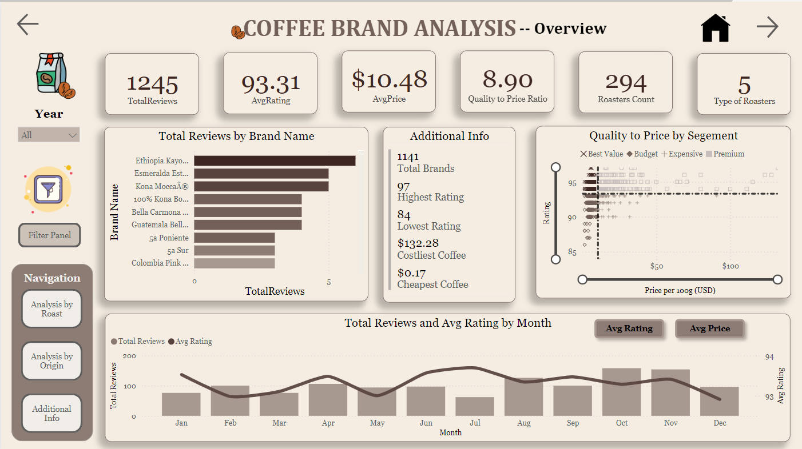

# Coffee Brand Analysis

## Overview

This Power BI report analyzes coffee brand reviews to provide insights into quality, pricing, and geographical distribution. It includes interactive visuals and detailed analysis across various dimensions.

## Live Dashboard Access

You can access the live dashboard [here](https://app.powerbi.com/view?r=eyJrIjoiZTJiOGNjMjgtOTUxNi00ODUzLTkxNTAtNzZlODRlYmY1NjY1IiwidCI6IjgzNjg3YmJjLTBkNzEtNDljYS05ODkwLTA2MmNjNjliMmQ4MCJ9&embedImagePlaceholder=true).

## Preview

## Files Description

### 1. Report.pdf
- **Description:** PDF version of the Power BI report.
- **Purpose:** Provides a static view of the interactive dashboard.

### 2. Coffee Brand Analysis.pbix
- **Description:** Power BI document containing all data connections, queries, and visualizations.
- **Purpose:** Allows for interactive exploration and analysis of coffee brand data.

### 3. Preview.png
- **Description:** Preview image showcasing the layout and design of the Power BI report.
- **Purpose:** Offers a visual preview of the report's appearance and structure.

## Tools Used

- **Power BI:** Used for data visualization, analysis, and report creation.
- **Excel:** Source of data stored in multiple sheets (Calendar, Coffee Brand Reviews, Data Dictionary).

## Report Creation Process

### 1. Data Collection

#### Data Sources
- **Calendar Dataset:** Provided date-related information for time-based analysis.
- **Coffee Brand Reviews Dataset:** Detailed reviews, ratings, prices, and descriptions of coffee brands.
- **Data Dictionary Dataset:** Definitions and explanations of columns in the reviews dataset.

#### Data Acquisition
- Extracted data from Excel files into Power BI for analysis.

### 2. Data Preparation

#### Data Cleaning
- Removed duplicates, null values, and standardized formats.
- Validated and corrected data inconsistencies.

### 3. Data Integration
- Merged Calendar and Coffee Brand Reviews datasets based on date keys.
- Created calculated columns for time-series and geographic analysis.

### 4. Creating Measures
- Calculated key metrics like Average Rating, Average Price, and Quality to Price Ratio (QPR).

### 5. Report Development

#### Power BI Visualizations
- Designed multiple pages:
  - **Overview:** KPIs, scatter plots, bar-line charts.
  - **Analysis by Roast:** Filtered visuals by roast type, bar charts, maps.
  - **Analysis by Origin:** Visuals categorized by coffee origin, bar charts, maps.
  - **Additional Info:** Detailed data table, word cloud charts.

#### Dashboard Design
- Implemented filter panels and navigation bars for user interaction.
- Ensured consistency in color schemes and branding elements.

### 6. Insights and Recommendations

#### Key Findings
- Identified top-performing coffee brands and origins based on ratings and reviews.
- Analyzed pricing trends across different roast types and origins.
- Discovered correlations between aroma, mouthfeel, and customer ratings.

#### Recommendations
- Recommended strategies to promote top-rated brands and target specific market segments.
- Suggested next steps for stakeholders based on insights and analysis.

